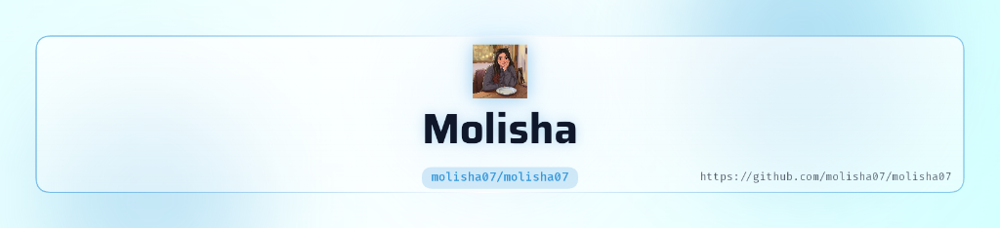
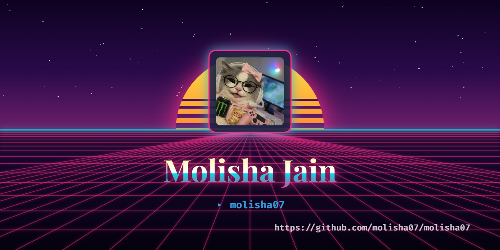

<!-- ============ HERO BANNER ============ -->
<picture>
  <source media="(prefers-color-scheme: dark)" srcset="assets/header-dark.png">
  
</picture>

# Hey there, I'm Molisha 👋

<!-- ============ TYPING SVG ============ -->

<!-- ============ GITHUB STATS BADGES ============ -->

## 🌸 About Me

<table>
<tr>
<td width="65%" valign="top">

- 🎓 **Currently pursuing** B.Tech in Artificial Intelligence & Data Science at K J Somaiya Institute of Technology, Mumbai (2023 – 2027)
- 💻 **Current focus:** Data Analytics, Data Engineering, and building AI-powered applications with LLMs & RAG
- 🌱 **Interests:** Power BI dashboards, Python automation, machine learning pipelines, and DevSecOps tooling
- 📈 **Learning goals:** Deepening my expertise in cloud data engineering and scalable ETL pipelines
- ⚡ **Fun fact:** I once automated a bulk image-to-WebP conversion pipeline that noticeably boosted a website's Core Web Vitals!
- 🤝 **Open to collaborate on:** Data Analytics, AI/ML projects, and Data Engineering pipelines

</td>
<td width="35%" valign="top" align="center">

</td>
</tr>
</table>

## 🩷 Tech Stack & Tools

<table width="100%">
  <tr>
    <td width="30%" align="center"><b>💻 Programming Languages</b></td>
    <td width="70%">
      
      
      
      
      
      
    </td>
  </tr>
  <tr>
    <td align="center"><b>📊 Data Science & AI</b></td>
    <td>
      
      
      
      
    </td>
  </tr>
  <tr>
    <td align="center"><b>🌐 Frameworks & Dev</b></td>
    <td>
      
      
      
      
      
    </td>
  </tr>
  <tr>
    <td align="center"><b>☁️ Cloud & Databases</b></td>
    <td>
      
      
      
      
    </td>
  </tr>
  <tr>
    <td align="center"><b>🛠️ Developer Tools</b></td>
    <td>
      
      
      
      
      
    </td>
  </tr>
</table>

## 🚀 Featured Projects

Here is a summary of my key projects, their implementation details, and corresponding source repositories:

<table width="100%">
  <thead>
    <tr>
      <th width="25%" align="left">📁 Project Name</th>
      <th width="45%" align="left">📝 Description & Features</th>
      <th width="30%" align="left">🛠️ Tech Stack & GitHub</th>
    </tr>
  </thead>
  <tbody>
    <tr>
      <td><b>Customer Churn Prediction</b></td>
      <td>
        A machine learning pipeline designed to predict customer churn using classification models.
        <ul>
          <li>Performs rigorous feature engineering & preprocessing.</li>
          <li>Visualizes key indicators using Matplotlib & Seaborn.</li>
          <li>Optimized model predictions using tuned hyperparameters.</li>
        </ul>
      </td>
      <td>
         
         
         
          
        👉 <b><a href="https://github.com/molisha07/customer-churn-prediction">View Repository</a></b>
      </td>
    </tr>
    <tr>
      <td><b>Intelligent AI DevSecOps Code Scanner</b></td>
      <td>
        An automated security scanner that analyzes source code for vulnerabilities and secrets.
        <ul>
          <li>Uses AI models for context-aware security scans.</li>
          <li>Generates interactive, color-coded security reports.</li>
          <li>Easily integrates into existing DevSecOps pipelines.</li>
        </ul>
      </td>
      <td>
         
         
         
          
        👉 <b><a href="https://github.com/molisha07/Intelligent-AI-DevSecOps-Code-Scanner">View Repository</a></b>
      </td>
    </tr>
    <tr>
      <td><b>Career Catalyst</b></td>
      <td>
        An AI-powered career assistant platform helping students optimize resumes and search job matching.
        <ul>
          <li>Features custom recommendation algorithms for job listings.</li>
          <li>Provides resume builder tool with PDF exports.</li>
          <li>Built with Flutter for high performance multi-platform support.</li>
        </ul>
      </td>
      <td>
         
         
         
          
        👉 <b><a href="https://github.com/molisha07/Career_catalyst">View Repository</a></b>
      </td>
    </tr>
    <tr>
      <td><b>Eventia</b></td>
      <td>
        An intuitive event management and discovery app supporting real-time seat reservation.
        <ul>
          <li>Allows users to discover, host, and check-in to events.</li>
          <li>Implements QR-code ticket scans for check-in tracking.</li>
          <li>Runs on Flutter frontend with an Express/Node.js backend.</li>
        </ul>
      </td>
      <td>
         
         
         
          
        👉 <b><a href="https://github.com/molisha07/Eventia">View Repository</a></b>
      </td>
    </tr>
  </tbody>
</table>

 

## 🐍 Contribution Snake

<picture>
  <source media="(prefers-color-scheme: dark)" srcset="https://raw.githubusercontent.com/molisha07/molisha07/output/github-contribution-grid-snake-dark.svg">
  
</picture>

## 💌 Connect With Me

## 🌷 Quote

> *"Data will talk to you if you're willing to listen."*
> — Jim Bergeson

<!-- ============ FOOTER ============ -->

**✨ Thanks for stopping by — let's build something amazing together! ✨**

